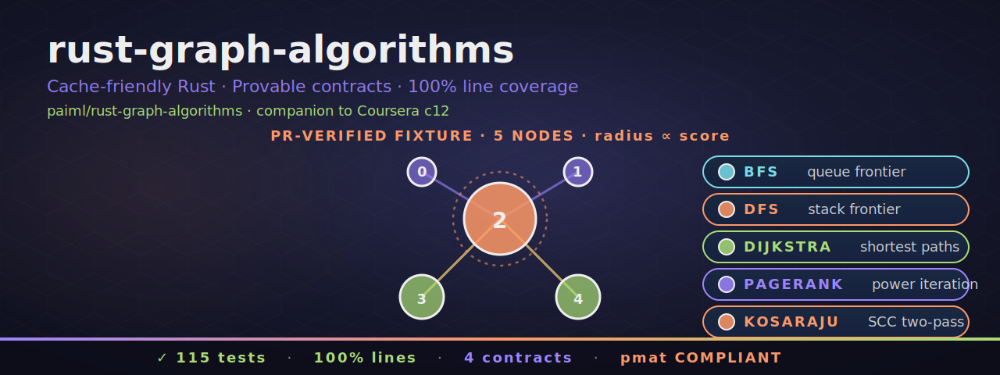

<p align="center">
  
</p>

[](https://github.com/paiml/rust-graph-algorithms/actions/workflows/ci.yml)
[](#license)
[](rust-toolchain.toml)
[](Makefile)
[](Makefile)
[](contracts/)

# rust-graph-algorithms

Reference Rust workspace for course **c12 — Graph Algorithms with
Rust** in the Coursera Rust for Data Engineering specialization.

The workspace ships **two layers**:

1. **Pure-Rust algorithm crates** — cache-friendly implementations of
   BFS, DFS, Dijkstra, degree and PageRank centrality, weakly-connected
   components, Kosaraju SCC — plus a Graphviz DOT exporter and a
   single-binary CLI (`graph`) that drives every algorithm against
   JSON on stdin.
2. **Real-`aprender-graph` demo crates** — working code that consumes
   the published [`aprender-graph 0.31.2`](https://crates.io/crates/aprender-graph)
   crate and the [`aprender-contracts 0.31.2`](https://crates.io/crates/aprender-contracts)
   library through `pmat query`. Every numeric and API claim that
   ships in the c12 lesson SVGs is verified by these demo crates at
   runtime.

**Four runtime contracts** are asserted on every successful CLI /
demo run; their YAML specs live in [`contracts/`](contracts) and are
linted by `pv lint contracts/` in CI.

## Workspace layout

### Algorithm crates

| Crate | Role | Runtime invariant |
|-------|------|-------------------|
| [`graph-core`](crates/graph-core) | `NodeId`, `Edge`, `Graph`, `GraphError` | `assert_edge_count_consistent` |
| [`graph-traversal`](crates/graph-traversal) | BFS, DFS, Dijkstra | `assert_bfs_distance_monotonic` |
| [`graph-centrality`](crates/graph-centrality) | out-degree, PageRank power iteration | `assert_pagerank_normalized` |
| [`graph-community`](crates/graph-community) | weakly-connected, Kosaraju SCC | `assert_components_partition` |
| [`graph-viz`](crates/graph-viz) | Graphviz DOT export | — |
| [`graph-cli`](crates/graph-cli) | `graph` binary wiring all five | runs every contract above |

### Demo + contract-checker crates

| Crate | Role |
|-------|------|
| [`aprender-demo`](crates/aprender-demo) | Working demo of real `aprender-graph 0.31.2`. Builds a 5-node fixture, runs BFS / PageRank / Kosaraju, asserts three runtime contracts. Companion to lesson 1.1.4. |
| [`aprender-contracts-demo`](crates/aprender-contracts-demo) | Parses YAML contracts via `provable_contracts::schema`, shells out to `pmat query` to discover bound functions, returns a typed `BindingReport`. Companion to lesson 5.1.5. |
| [`svg-layout-checker`](crates/svg-layout-checker) | Falsifier for the c12 SVG layout contract — five structural floors (canvas size, shape count, named-group bounds, fill diversity, font-size floor) checked against any SVG source. |

> **Namespace note.** `aprender-graph` 0.31.2 keeps a legacy
> `[lib] name = "trueno_graph"` for backward compatibility. We
> collapse that at the dependency boundary using Cargo's `package = `
> rename so consumer code only ever sees `aprender_graph`:
> ```toml
> [dependencies]
> aprender_graph = { package = "aprender-graph", version = "0.31.2", default-features = false }
> ```
> Then `use aprender_graph::*;` works directly. One namespace, end to end.

## Install

```bash
git clone https://github.com/paiml/rust-graph-algorithms
cd rust-graph-algorithms
cargo build --release --workspace
./target/release/graph --help
```

## Quick start — the `graph` CLI

```bash
echo '{"nodes":3,"edges":[
  {"from":0,"to":1,"weight":1},
  {"from":1,"to":2,"weight":1},
  {"from":2,"to":0,"weight":1}
]}' | cargo run -p graph-cli -q -- bfs --source 0
# {"kind":"bfs","order":[0,1,2]}
```

The same JSON drives every subcommand: `bfs`, `dfs`, `dijkstra`,
`pagerank`, `components`, `scc`, `dot`. Run `graph --help` for the
full list.

## Quick start — the aprender-graph demo

```bash
cargo run -p aprender-demo --example inspect
# num_nodes:    5
# bfs_order:    [4, 3, 2, 0]
# pagerank:     [0.030, 0.030, 0.476, 0.232, 0.232]
# pagerank_sum: 1.000002
# sccs:         [[1], [0], [2,3,4]]
# winner:       2
```

These are the exact values the c12 1.1.4 SVG quotes — verified, not
hand-computed.

## Quick start — discover bindings via pmat query

```bash
cargo run -p aprender-contracts-demo --example discover
# contract version  : 1.0.0
# obligation count  : 3
# bindings          : 3
#   [1] PageRank normalization on the demo fixture
#       → run_demo, pagerank_scores_match_expected, build_demo_graph, DemoReport
#   [2] SCC partition on the demo fixture
#       → assert_components_partition_passes_on_real_sccs, ...
#   [3] Hub node 2 is the PageRank winner
#       → winner_is_node_2, build_demo_graph, pagerank, run_demo
```

Requires `pmat` on PATH.

## Local CI gate

Mirror what `gate` runs in CI:

```bash
make ship-ready
```

That runs format-check, clippy, doc with warnings-as-errors, test,
doc-test, **100% line coverage** (`cargo llvm-cov --fail-under-lines 100`),
`cargo audit`, `cargo deny`, contract lint (`pv`), Makefile lint
(`bashrs`), and `pmat comply`.

## Provable contracts

Four YAML specs in [`contracts/`](contracts), each linted by
`pv lint contracts/` in CI.

| Contract | What it gates |
|----------|---------------|
| [`graph-algorithms-v1.yaml`](contracts/graph-algorithms-v1.yaml) | edge-count consistency, PageRank normalization, component partition |
| [`aprender-demo-v1.yaml`](contracts/aprender-demo-v1.yaml) | demo-fixture PageRank normalization, SCC partition, hub-node-2 winner invariant |
| [`aprender-contracts-demo-v1.yaml`](contracts/aprender-contracts-demo-v1.yaml) | one-binding-per-obligation, terms-preserved-verbatim, runner-error context propagation |
| [`svg-layout-v1.yaml`](contracts/svg-layout-v1.yaml) | canvas-size invariant, ≥40 shapes, 5–20 named groups, ≥8 distinct fills, font-size ≥18 |

Every obligation carries a falsification test id (`FALSIFY-XXX-NNN`)
that binds the YAML claim to a concrete unit test in the workspace.
The chain is: YAML → parse → `pmat query` → BindingReport → live
runtime assert.

## Status

```
115 tests / 100% line coverage / 100% function coverage
0 clippy warnings / 4 provable contracts / pv lint PASS
pmat comply COMPLIANT / aprender-graph 0.31.2
```

## License

Dual-licensed under either of

- [Apache License, Version 2.0](LICENSE-APACHE)
- [MIT License](LICENSE-MIT)

at your option.
